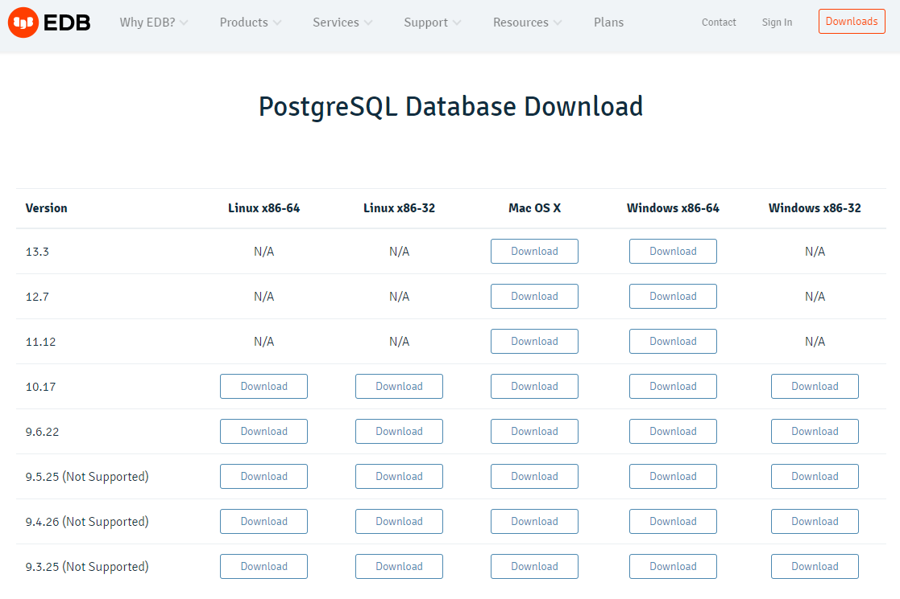
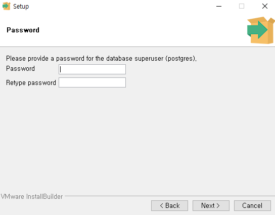
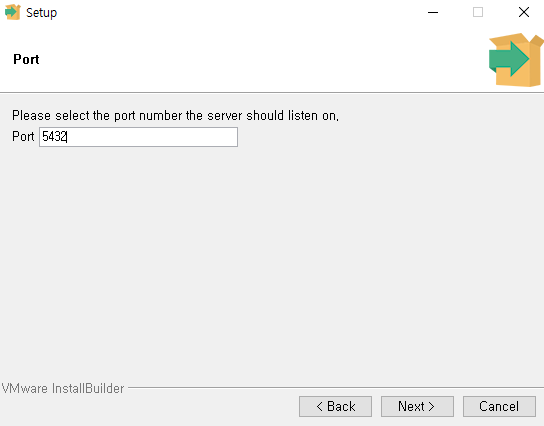
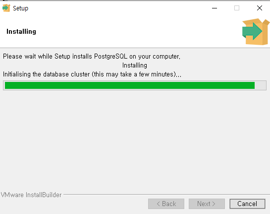
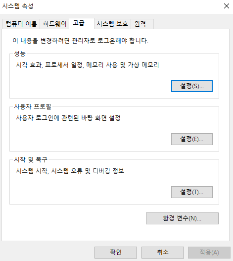

## postgresql 강의
### Windows 
- PostgreSQL Downloads
    + URL: https://www.enterprisedb.com/downloads/postgres-postgresql-downloads
    + 각 컴퓨터에 맞는 버전을 선택합니다.
  


  
- 필자는 13.3 버전을 선택하였습니다. 

- 이번에는 프로그램을 클릭하여 설치를 진행합니다. 


- 모든 값은 default로 진행합니다. 
- 비밀번호는 작성 후, 반드시 기억하시기를 바랍니다. 
  + 필자는 temp라고 명명하였습니다.
  


- 포트는 5432를 확인합니다. 



- 언어는 한국어로 선택하도록 합니다. 


- 몇번의 Next를 더 누르시면서, 설치를 진행합니다. 



- 설치가 완료되면 Stack Builder 체크 박스는 ㅎ제 후 완료를 합니다. 


- 프로그램을 검색하여 PostgreSQL이 잘 설정되는지 확인을 하도록 합니다. 


## 환경변수 추가
- CMD에서 활용하려면 환경변수를 설정하도록 합니다. 
- 먼저 경로를 복사합니다.


```bash 
C:\Program Files\PostgreSQL\13\bin
```

- 제어판-시스템 및 보안-시스템-설정 변경 순으로 클릭한 뒤, 시스템 속성 창으로 들어갑니다. 시스템 속성 창에서 고급-환경변수 순으로 클릭합니다. 


