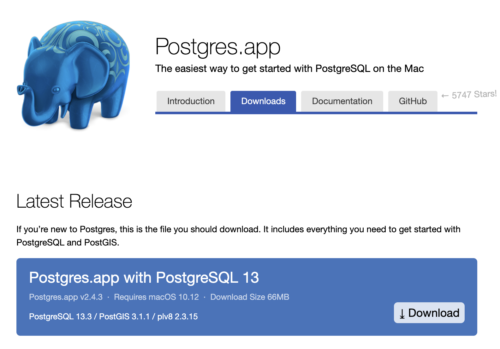

# postgresql 설치
## Windows 
### 프로그램 다운로드
- PostgreSQL Downloads
    + URL: https://www.enterprisedb.com/downloads/postgres-postgresql-downloads
    + 각 컴퓨터에 맞는 버전을 선택합니다.
  


  
- 필자는 13.3 버전을 선택하였습니다. 

- 이번에는 프로그램을 클릭하여 설치를 진행합니다. 


- 모든 값은 default로 진행합니다. 
- 비밀번호는 작성 후, 반드시 기억하시기를 바랍니다. 
  + 필자는 temp라고 명명하였습니다.
  


- 포트는 5432를 확인합니다. 


- 언어는 한국어로 선택하도록 합니다. 


- 몇번의 Next를 더 누르시면서, 설치를 진행합니다. 


- 설치가 완료되면 Stack Builder 체크 박스는 ㅎ제 후 완료를 합니다. 


- 프로그램을 검색하여 PostgreSQL이 잘 설정되는지 확인을 하도록 합니다. 


### 환경변수 설정
- CMD에서 활용하려면 환경변수를 설정하도록 합니다. 
- 먼저 경로를 복사합니다.


```bash 
C:\Program Files\PostgreSQL\13\bin
```

- 제어판-시스템 및 보안-시스템-설정 변경 순으로 클릭한 뒤, 시스템 속성 창으로 들어갑니다. 시스템 속성 창에서 고급-환경변수 순으로 클릭합니다. 


## MacOS
### 프로그램 다운로드
- 해당 웹 페이지로 간다. (URL: https://postgresapp.com/)

  
- 다운로드 받은 후 `Postgres-2.4.3-13.dmg` (2021.5.31일 기준) 설치 파일을 클릭한 후, 아래 화면이 나오면, 설치를 진행합니다. 

  
- 설치 진행이 완료가 되면 아래 화면에서 `Initialize` 또는 `Start` 버튼을 클릭하면 설치는 끝이 납니다. 


### 환경변수 설정
- 그런데, 환경변수 설정을 하지 않으면 터미널에서 실행이 되지 않습니다. 
```bash 
$ psql
-bash: psql: command not found
```


- 이 때, 환경변수를 설정해야 합니다.
- 먼저, Applications > postgres app > show package contents 순으로 클릭합니다.


- `/Applications/Postgres.app/Contents/Versions/13/bin` 순으로 접근합니다. 해당 경로를 복사합니다. 
  + Tip: 아래 메뉴에서 `옵션(Options)키`를 클릭 하면 `Copy "bin" as Pathname`이 메뉴가 나옵니다. 해당 부분을 클릭하면 위 경로를 얻을 수 있습니다. 
  


  
- 이제 터미널을 엽니다. 
  + 필자는 `bash_profile` 파일에서 환경 변수를 관리합니다. 각각의 환경변수 파일은 다를 수 있으니 주의 바랍니다.

- 필자는 아래와 같이 설정 하였습니다. 
```bass
export PATH=/opt/homebrew/bin:$PATH:/Applications/Postgres.app/Contents/Versions/13/bin
```

## 프로그램 실행 
- 새로운 터미널을 열고, 이제 `psql`을 실행합니다. 이제 정상적으로 실행되는 것을 볼 수 있습니다. 
```bash
~ evan$ psql
psql (13.3)
Type "help" for help.

evan=# 
```


- 간단한 명령어를 작성합니다. 
```bash 
evan=# \list
                                  List of databases
   Name    |  Owner   | Encoding |   Collate   |    Ctype    |   Access privileges   
-----------+----------+----------+-------------+-------------+-----------------------
 evan      | evan     | UTF8     | en_US.UTF-8 | en_US.UTF-8 | 
 postgres  | postgres | UTF8     | en_US.UTF-8 | en_US.UTF-8 | 
 template0 | postgres | UTF8     | en_US.UTF-8 | en_US.UTF-8 | =c/postgres          +
           |          |          |             |             | postgres=CTc/postgres
 template1 | postgres | UTF8     | en_US.UTF-8 | en_US.UTF-8 | =c/postgres          +
           |          |          |             |             | postgres=CTc/postgres
(4 rows)
```


